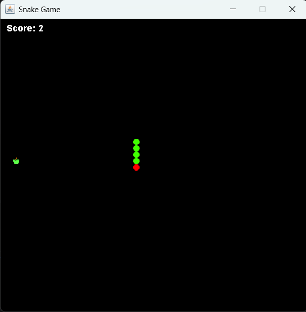
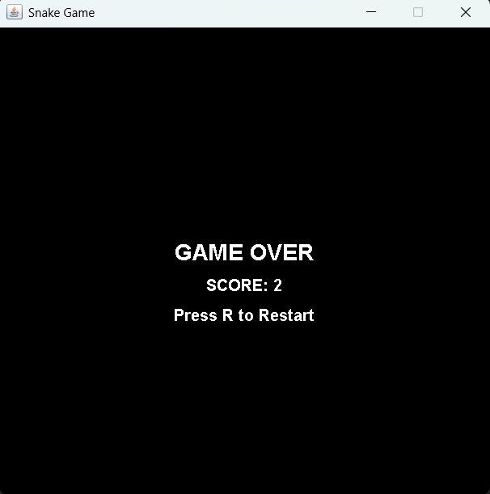

# Snake Game – Java Swing

## Overview
This project is a classic Snake Game developed using Java Swing for the graphical user interface.  
The player controls a snake that grows longer as it eats food while avoiding collisions with the walls and its own body.

## Features
- Snake movement using keyboard arrow keys
- Random food generation
- Score tracking system
- Collision detection with walls and snake body
- Real-time graphical interface using Java Swing

## Technologies Used
- Java
- Swing
- AWT
- Object-Oriented Programming (OOP)

## Project Structure
```
Snake_Game
│
├── SnakeGame.java
├── GamePanel.java
└── images
    ├── snake_head.png
    ├── snake_body.png
    └── food.png
```

## How to Run the Project

1. Clone the repository

```
git clone https://github.com/yourusername/snake-game-java.git
```

2. Open the project in any Java IDE such as:
- Visual Studio Code
- IntelliJ IDEA
- Eclipse

3. Compile and run the main file:

```
SnakeGame.java
```

4. Use the arrow keys to control the snake.

## Learning Outcomes
- Implemented event-driven programming in Java
- Applied object-oriented programming concepts
- Built an interactive GUI-based application

## Author
Shaik Kareem  
Computer Science Engineering Student

## Project Interface

### Game Start Screen


### Gameplay Screen

